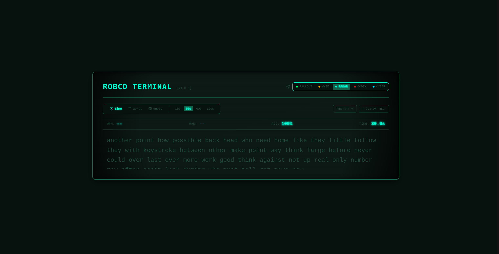

# Typedesk

A retro RobCo CRT terminal-inspired typing application built with React 19, TypeScript, and Vite. Designed for layout stability, high-precision monotonic timing (`performance.now()`), and responsive keystroke handling.

🚀 **Live Demo:** [https://shoytanbaba99.github.io/typedesk/](https://shoytanbaba99.github.io/typedesk/)



---

## Features

- **Monospace Engine:** Pre-broken line matrices to eliminate layout shifts during fast typing.
- **Monotonic Timekeeping:** High-precision `performance.now()` timer loop using `requestAnimationFrame` with OS hibernation and sleep guards.
- **Dynamic Word Stream:** Continuous word generation in Time Mode (15s, 30s, 60s, 120s) so fast typists never run out of text.
- **Custom Text Ingestion:** Plain text and JSON array ingestion (`["react", "typescript", "vite"]`) with defensive schema validation and a 500-word truncation guard.
- **Zero-Dependency SVG Analytics:** Native SVG `<polyline>` speed history graph and a physical QWERTY keyboard error heatmap with relative crimson intensity shading.
- **Speed Metrics:** Real-time Net WPM, Raw WPM, Accuracy %, character breakdown (correct / incorrect / extra), and elapsed time.
- **Terminal Ergonomics:** Quick restart shortcut (`Tab + Enter`), CRT theme switching (Fallout Green, Wyse Amber, Cold War Radar, Monastic Codex, Cyberpunk Edo), theme-specific Web Audio API sound synthesizers, RobCo cathode boot sequence, and keyboard navigation support.

---

## Custom Text & AI Prompt Template

Typedesk supports custom text or JSON string arrays up to 500 words. You can use any AI assistant (ChatGPT, Claude, Gemini) to generate custom typing tests using this prompt template:

### 🤖 Copy-Paste AI Prompt Template
> *"Generate a JSON array containing 30-50 technical programming words or code keywords for a typing test. Format the response strictly as a valid JSON array of strings, like this: `[\"const\", \"async\", \"await\", \"promise\", \"interface\"]`."*

### 📋 Valid JSON Input Example
```json
[
  "react",
  "typescript",
  "vite",
  "performance",
  "monospace",
  "terminal",
  "component",
  "state"
]
```

---

## Architecture & Engineering Highlights

- **Pure Derived State:** Derives modal visibility directly during render instead of triggering `setState` inside `useEffect`, avoiding anti-patterns and eliminating cascading re-renders.
- **CSS Custom Property Design System:** Theme switching is managed via `[data-theme="..."]` CSS custom properties on the root element, allowing visual updates without triggering React Virtual DOM diffing or component re-renders.
- **Optimized Event Engine:** Hot-path keydown engine relies on `useRef` trackers to minimize React state churn during fast typing sequences.
- **Overlay Layer Scoping:** Applies `pointer-events: none` directly to CRT scanline and flicker overlay `<div>` elements to keep interactive UI controls mouse-clickable.

---

## Tech Stack

- **Framework:** React 19 + TypeScript
- **Build Tool:** Vite 8
- **Styling:** Tailwind CSS v4 + Vanilla CSS CRT Scanline & Phosphor Filters
- **Icons:** Lucide React
- **CI/CD:** GitHub Actions (`actions/configure-pages@v5` on Node 22)

---

## Development

```bash
# Install dependencies
npm install

# Start development server
npm run dev

# Typecheck and build production bundle
npm run build

# Preview build locally
npm run preview
```

---

## Developer Note & Reflection

I originally started this project to learn, master, and properly understand React, UI/UX design, and modern frontend development. As I built out the features, things like high-precision timing, zero-reflow line matrices, dynamic word streaming, SVG charts, and complex state synchronization quickly grew much more complicated than I expected and got over my head.

To get the application finished and bring the retro CRT terminal idea to life without getting stuck forever, I leaned heavily on AI tools ("vibe coding") to help write and refactor the code. The app is fully working and deployed live, but I want to be honest that I am still learning and working to fully master all the React patterns and frontend architecture used in this project.

---

## License

MIT
